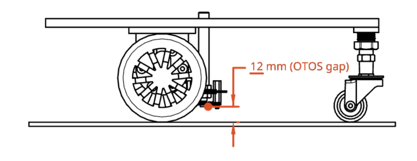
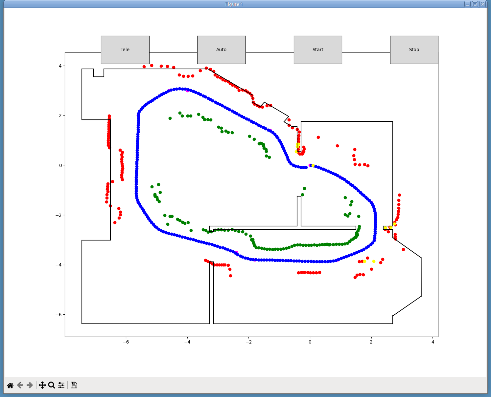

# PicoBot with Optical Tracking Odometry
* I have long wondered if optical flow technology could be used to replace wheel odometry but I have never gotten around to undertaking the project. Well, it turns out this sensor was worth the wait because it works very well on the laminated vinyl flooring throughout my house.
* This project describes the use of SparkFun's recently introduced [Optical Tracking Odometry Sensor (OTOS)](https://www.sparkfun.com/sparkfun-optical-tracking-odometry-sensor-paa5160e1-qwiic.html) to
replace the wheel odometry system I have been using, which relies on using motor encoders and an IMU.
* The robot used is the PicoBot described in this [earlier project](https://github.com/dblanding/PicoBot-dev).

## Power to the Pico
* Power is supplied to the Pico from multiple sources:
    1. Connected to a laptop by USB cable
    2. Powered by an onboard battery
    3. Both USB & battery at once

* When powered by a 5V source, care must be taken to connect the source to the VSYS pin (pin 39) through a Schottky diode.
* Conveniently, the L298N Motor Driver board provides a 5V power supply.
* If the Pico is connected to the laptop by USB cable, regardless of whether the battery switch is ON or OFF, the voltage at the Vsys pin is just a bit under 5 Volts.
* If the Pico is *not* connected to the laptop, and the battery switch is ON, the voltage at the Vsys pin is still just a bit under 5 V.
* In either case, the **diode** safely resolves any voltage conflicts on the Vsys pin and the Pico remains happily powered, putting out 3.3V on its 3V3 pin.

## PicoBot CAD model
* It's not essential to have a CAD model but it can be helpful when developing and exploring alternative configurations. Here is a link to the [PicoBot CAD model](https://cad.onshape.com/documents/a467fa491507e4344e74773f/w/ba0afe661856bb450bf6a220/e/833b2810e351b814296b3291?renderMode=0&uiState=67ec61ff799e52259c7ebdd3), showing some of the critical components in the actual physical PicoBot.

## Mounting the OTO Sensor
* SparkFun recommends the Sensor be set to have a working range of 10 - 27 mm, and that for FTC it be set at exactly 10 mm.
* I have the gap set at about 12 mm on the PicoBot and it seems to work very well.

## Running the code:
* The [robot folder](robot) contains files that are run on the Pico
* The [laptop folder](laptop) contains files that are run on the laptop

* To Operate the PicoBot:
    1. Place the PicoBot in its **Home** pose = (0, 0, 0) on the floor of the arena.
    2. Turn the PicoBot power switch **ON**. This starts the file `main.py` on the robot.
    3. Open the Bluefruit Connect cell phone app.
    
    
    
    * 2 BLE UART Friend devices will be listed, but you don't neccesarily know which device is on which uart.
        * The one marked **0** is on UART0 and the one marked **1** is on UART1, both with a flashing red LED
    * Connect to the one on **UART0**
        * The connected device will now have a solid blue LED
        * If the UART1 device LED is lit, disconnect and click on the other one.
        * Now, only the device on UART0 has its blue LED on.
    * Next, select **Controller** on the phone app
    * Lay the phone down on a horizontal surface and click **Accelerometer**
    4. On the laptop, run the file `display_from_robot.py`.
    * It's important to have the phone app already connected so the laptop has no other choice but to connect to the device on UART1.
    * A window will be launched with a map of the Arena and some Buttons across the top.
        * Sometimes, an `Error parsing JSON` will occur and the map doesn't get drawn.
        * If this happens, just run the file again.
        * When the window appears with a map of the Arena, click on the **Start** Button.
        * Now the PicoBot is ready to go. (The motors might sing briefly.)
    

    
## Driving the car.
* **Carefully** pick up the phone, trying to keep it level.
* Drive the car by tipping and tilting the phone.
    * Imagine there is a small ball on the face of the phone.
    * Tipping the phone so the ball rolls away from you (toward the top) causes the robot to drive forward.
    * Tilting the phone to the right or left causes the robot to turn right or left.
    * Returning the phone to a level surface causes the robot to stop.
* Colored dots will be drawn on the map as the robot drives.
    * Blue dots show the path the robot has taken.
    * Red dots show the location of objects detected by the left distance sensor.
    * Green dots show the location of objects detected by the right distance sensor.
    * Yellow dots show the location of objects detected by the forward looking sensor.
* If everything is working perfectly, the Red, Green and Yellow dots will fall into place on the black lines of the Arena map.

    

My *Arena* is actually a room where my desk is located, and which has 2 doorways. This next map shows the path of the PicoBot starting at its home position, then driving across the room, out one of the doorways, through some adjacent rooms and back again to its starting point. The trail of Blue dots shows the PicoBot's path from start to finish.

* Start pose: [0.01068115, 0.0, -0.05809947]
* Finish pose: [0.0009155273, -0.1760864, -0.03528153]

This optical tracking odometer is really quite a remarkable device. There's no way my old wheel odometry system was this good.

